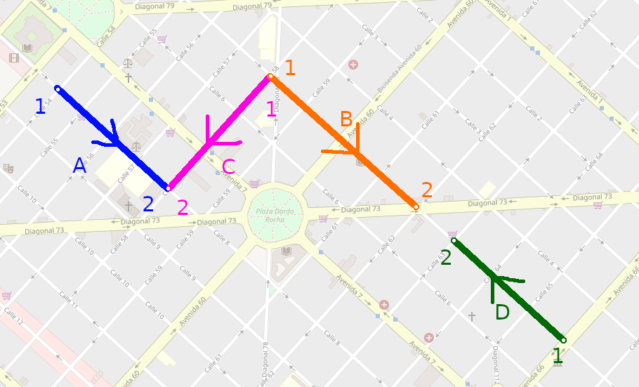
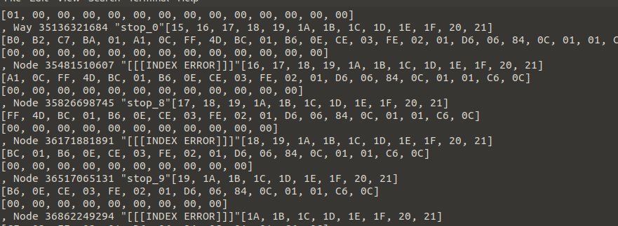
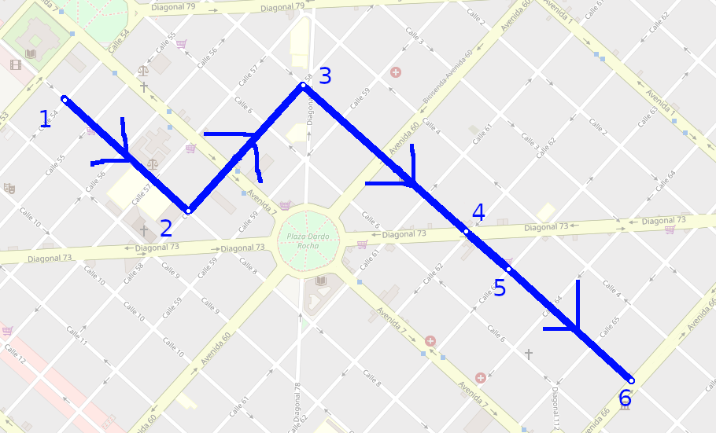
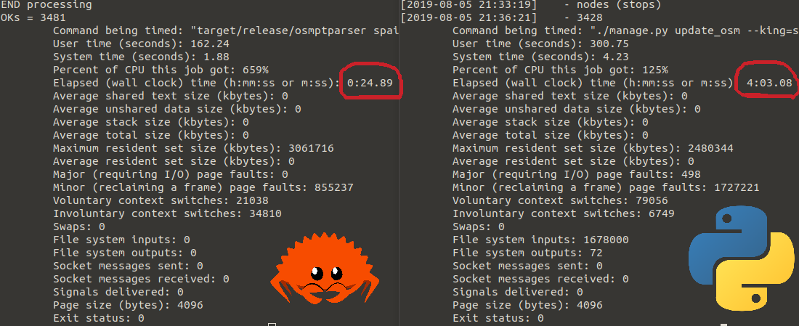
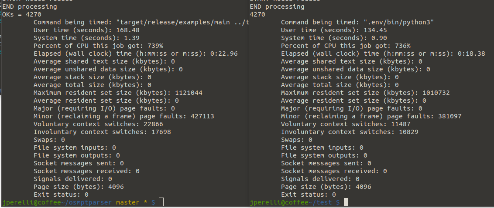

This article ended up being longer than expected TL;DR; (aka index) follows
- [skip to the python algorithm](#python)
- [skip to the rust action](#rust)
- [skip to the python-rust interface](#python-rust)
- [skip to the benchmarks](#benchmarks)

# Why?

Some time ago I got interested in new programming languages as Clojure, Elm, Rust, Julia, Go... Why would someone create a new language in 2010? Don't we have enough of those? (spoiler: NO). Eventually [we tried Go in cualbondi](https://github.com/cualbondi/poller), and althrough it had a set of nicities, I found it was almost the same as old C with some syntactic sugar added, similar to what OpenMP would achieve. I got somewhat dissapointed, and threw the idea of trying new languages into the freezer.

A few weeks ago I saw in the results of the stackoverflow survey that Rust had been the "most loved" programming language for the last 5 years. That revived the idea of trying a new language and I started looking into it. At first it looked like the same, syntax is no different from C, Js, Java, but as I read throgh documentation, something called "borrowing" started to appear. I investigated into that a little more, and started playing with some examples.
I went through the "hello world" and started getting errors of the borrow checker. I didn't understood what was happening, why was I getting that weird errors from the compiler?

Then I realized, 10 years after graduating, after 10 years of professional programming, I was about to learn a new basic concept: data races. This was shocking, I was a programmer for so long without stumbling with anything new I thought I had all the basics covered and wasn't expecting a new language to feature something that I haven't seen. I was excited to learn and try this new fundamental thing.

The basic idea is that the compiler would never let you to have a data race, and this for me is a unique feature of Rust that keeps me free from a lot of bugs that I was never aware of. This is something that later would proof to be incredible, once I passed all the compiler errors, when I hit run, the program would not crash, not a single time. Coming from other languages, this seems crazy. In other languages I would almost never run a program for the first time without crashing. That can only happen by chance with a really low probability, only good luck.

# What?

I started looking where could I apply Rust. From what I read, rust is secure, has exceptional performance and helps with parallelism. Then I thought of a problem I was working on in cualbondi: it's a public transport importer module that takes data from a 2Gib openstreetmap dump and converts it to cualbondi's format. The importer is really slow, because it has to process a huge file and keep a big cache, and then cross join geographic data to find polylines that represent the paths on which public transport drive.

Specifically, openstreetmap has a logical model like this:
```
relation
    - id      [int]
    - tags    [dict (key: str, value: str)]
    - members [list (type, id, role)] ids of relations, nodes or ways
way
    - id      [int]
    - tags    [dict (key: str, value: str)]
    - nodes   [list (id)]
node
    - id      [int]
    - tags    [dict (key: str, value: str)]
    - lon     [float]
    - lat     [float]
```

For example in the next image, a relation would be all the data that is highlighted, composed by 4 ways (each segment in a different color) and 6 nodes, each one at the end of a line.




This comes packaged in a file (I used the pbf format) all mixed up, so you can have the records inside a file coming like this scrumbled soup of characters
```
node (id=1, tags={}, lon=-31.2123, lat=32.12332)
way (id=1, tags={name: avenida1, surface: asphalt}, nodes=[1, 2])
relation (id=2, tags={route: bus, name: bus2}, members=[{type: way, id: 1, role: ''}, {type: way, id: 2, role: 'forward'}, {type: node, id: 1, role: 'stop'}])
node (id=2, tags={amenity: police, name: policestation123}, lon=12.123, lat=21.123)
relation (id=1, tags={route: bus, name: bus1}, members=[{type: way, id: 5}, {type: node, id: 3}, {type: way, id: 4}, {type: way, id: 5}])
... more data ...
```

Or even worse, that looks like this when trying to debug raw pbf format



so, the public transport data comes as a "relation". The format that cualbondi needs if a public transport is something like:
```
public transport
    - name     [string]
    - polyline [list (lon: float, lat: float)]
```

In order to build that, I had built a python algorithm that makes three sequential passes through the osm file data:
 1. first pass:
    - Collect (save in a cache) all the RELATIONs data that have tag `route: bus`
    - Save all the member way ids
    - Save all the member node ids that have the role=stop
 2. second pass:
    - Collect all the WAYs data that are in the relations way ids got in first pass
    - Save all the node ids of each way
 3. third pass:
    - Collect all the NODEs data that are in the relation ids (stops) and in the way ids got in first and second pass
    - Save all the nodes lon/lat

Now with all that data I can iterate throught it to recreate the polylines as a simple list of lon/lat for each one of the Relations.

## Challenges

Openstreetmap is a database that defines only the generic relation/way/node, but for all the relations between them, it only relies in consensus and de-facto standards that are created between the people that edits the data. There is no software that enforces data standards or meaningful validation. So for example inside the tags can actually be anything with any meaning, or the relations can have members that are not actually way route ids (it could be way ids from other objects like rivers, buildings, power lines or anything that can be represented with a `way` in osm).

This leads to some data problems, like broken public transport routes. For example, it can be that a relation that should be composed of 3 ways, only have 2 ways and there is a gap in between. Although the second way exists in the database, is not set as a "member" of the "relation" in which should be.

So I made an algorithm, called fix_ways in python that tries to fix this gaps and create a single connected polyline without gaps that makes sense. This algorithm in the worst cases is super slow and inefficient, it tries to solve the problem by using different sub algorithms that only run if the previous could not find a solution.

The worst case complexity is something like O(n^2) and involves difficult math operations (sin, sqrt, atan) to get distance between points.

## <span id="python"> Original Python algorithm </span>

I used [libosmium](https://github.com/osmcode/pyosmium) for it.

### 0. cache

All the data is stored in a few variables that act as a cache to be able to keep the data between passes, and build the final result later. Those variables look like this

```python
buses = {}  # { relation_id: { name: name, fixed_way: GEOSGeom, ways: { way_id: { name: name, nodes: { node_id: { lat: lat, lng: lng } } } } } }
ways = {}  # aux structure { way_id: [ relation_id ] }
stops = {}  # aux structure { node_id: [ relation_id ] }
```

### 1. first pass

This is a simplified version of the algorithm to get the relevant relations into the cache.
[full version here](https://github.com/cualbondi/web/blob/d5fd23c02cce75ce2fbd0d1b1dbd509d4bb3c064/apps/catastro/management/commands/update_osm.py#L593)

```python
class RelsHandler(osmium.SimpleHandler):
    def relation(self, r):
        if rel.tags['route'] == 'bus':
            bus = {
                'name': rel.tags['name'],
                'ways': [],
            }
            for mem in rel.members:
                if mem.type == 'w':
                    bus['ways'].append(mem.id)
                    ways[mem.id].append(rel.id)
            buses[rel.id] = bus

RelsHandler().apply_file(inputfile)
```

### 2. second pass

This is a simplified version of the algorithm to get the ways from the ways cache ids collected in the previous pass.
[full version here](https://github.com/cualbondi/web/blob/d5fd23c02cce75ce2fbd0d1b1dbd509d4bb3c064/apps/catastro/management/commands/update_osm.py#L622)

```python
class WaysHandler(osmium.SimpleHandler):
    def way(self, w):
        # if this id is in the cache, I need to get this ways data
        if w.id in ways:
            linestring = [[node.lon, node.lat] for node in w.nodes]

            for rel_id in ways[w.id]:
                buses[rel_id]['ways'][i] = linestring

WaysHandler().apply_file(inputfile, locations=True)
```

note: locations=True makes possible to use `[node.lon, node.lat]`, it auto collects the nodes data for the ways iterations

### 3. third pass

This is a simplified version of the algorithm to get the nodes from the nodes cache ids collected in the previous passes.
[full version here](https://github.com/cualbondi/web/blob/d5fd23c02cce75ce2fbd0d1b1dbd509d4bb3c064/apps/catastro/management/commands/update_osm.py#L634)

```python
class NodesHandler(osmium.SimpleHandler):
    def node(self, n):
        if n.id in stops:
            stop = {
                'osm_id': n.id,
                'name': n.tags['name'],
                'point': Point([n.lon, n.lat]),
                'tags': n.tags,
            }

            for rel_id in stops[n.id]:
                for i, nid in enumerate(buses[rel_id]['stops']):
                    if nid == n.id:
                        buses[rel_id]['stops'][i] = stop
```

### 4. Collect (fold/reduce) and fix_ways

Collect and call the fix_way function:

```python
for bus_id, bus in buses.items():
    way, status = fix_way(bus['ways'], 150)
    buses[bus_id]['way'] = LineString(way) if way else None
    buses[bus_id]['status'] = status
```

#### fix_ways(ways, gap)

This function takes a list of lists of lonlat and tries to flatten it into a list of lonlat by attaching all the pieces into one by the extremes. If there are gaps between the pieces, and they are shorter than the second parameter `gap`, then it joins the ways together.

```python
fix_ways([[(lon, lat), ...], ...]) -> [(lon, lat), ...]
```

Problem: the data comes from openstreetmap unordered and also broken with gaps like this

so, here we have a the next information
```
relation:
    way A:
        node A1: lat X, lng Y
        node A2: lat X, lng Y
    way B:
        node B1: lat X, lng Y
        node B2: lat X, lng Y
    way C:
        node C1: lat X, lng Y
        node C2: lat X, lng Y
    way D:
        node D1: lat X, lng Y
        node D2: lat X, lng Y
```

The fix_ways() algorithm tries to convert that information into a smooth polyline with it's nodes ordered and without gaps like this

and we transform it to the next information
```
polyline: [
    {lat: X, lng: Y},
    {lat: X, lng: Y},
    {lat: X, lng: Y},
    {lat: X, lng: Y},
    {lat: X, lng: Y},
    {lat: X, lng: Y},
]
```

A simplifyed algorithm to accomplish this is
```python
def fix_ways(relation, gap_allowed)
    # joins only consecutive ways that share a node with the same lonlat, also tries reversing ways
    joined = join_ways(relation)

    # sort ways by the ones that are closest to each other (this reorders ways, in the example, this would reorder the ways leaving them as A,C,B,D)
    # and then applies also the join algorithm again
    sorted_joined = join_ways(sort_ways(joined))

    # joins ways that are next to each other by a distance of less than gap_allowed in meters
    fixed = join_gaps(sorted_joined, gap_allowed)

    return fixed
```
[you can see the full code here](https://github.com/cualbondi/web/blob/d5fd23c02cce75ce2fbd0d1b1dbd509d4bb3c064/apps/utils/fix_way.py#L255)

# <span id="rust"> Oxidizing / a.k.a Rustifying </span>

## Ideas

The idea was to rewrite both the collect algorithm and the fix_ways in Rust, and then call that from pyton. Luckily it exists pyo3 to interface rust and python, and there is already GEOS for rusty that could be useful for gis algorithms if needed.

So I started trying to find a way to read the osm file. I had initially used .osm format, and I search for libraries in rust that read osm formats. I found a few that read directly pbf format and went to try those.

The only one I could make work actually in parallel was rust-iter-pbf. When I got to the second pass, I found an issue that broke all things. Reported issue and solved.

## Algorithm implementation

Although the implementation is a lot longer in lines of code, I think that the task is actually doing a more complex job, because it works in parallel.
It starts reading the file in blocks that are read in parallel, for the three passes (each pass is done secuentially), and then there is a collect fold/reduce step done in parallel too.
```
       ------------------------- Parser::new() ---------------   - p.get_public_transports() -
      /                                                       \ /                             \
        -> first \         -> second \         -> third \  MATERIA   - >    reduce        \
start -+-> first -+-cache-+-> second -+-cache-+-> third -+- LIZED -+ - >    reduce        +--> result
        -> ...   /         -> second /         -> third /   CACHE    - >    reduce        /
```

### 0. cache

Basically the `Parser.relations`, `Parser.ways` and `Parser.nodes` act as a cache,  pretty similar to the python version, but with the difference that in rust, we must know the size of the memory from before compilation, so we need to know all the types and what objects we are going to have inside.

```rust
#[derive(Clone, Debug)]
struct NodeData {
    id: u64,
    lat: f64,
    lon: f64,
    tags: HashMap<String, String>,
}

#[derive(Clone, Debug)]
struct WayData {
    id: u64,
    tags: HashMap<String, String>,
    nodes: Vec<u64>,
}

#[derive(Clone, Debug)]
struct RelationData {
    id: u64,
    tags: HashMap<String, String>,
    ways: Vec<u64>,
    stops: Vec<u64>,
}

#[derive(Clone)]
pub struct Parser {
    relations: Vec<RelationData>,
    ways: HashMap<u64, WayData>,
    nodes: HashMap<u64, NodeData>,
    cpus: usize,
}
```

### 1. first pass

Simplified parallel threaded solution

 1. master thread opens pbf file and starts iterating over chunks (namely primitive_block)
 2. master sends each chunk round robin to workers as message
    1. worker blocks receiving message
    2. process chunk and find all relations
    3. save relations in thread local cache
    4. wait for next chunk
    5. on channel close, send local cache to master
 3. master iterates over workers, closing sending channel and waiting to receive channel final message (thread local cache). Then collect all threads local caches into one master cache


```rust
// create a vector of channels
let mut workers = Vec::with_capacity(cpus);

// iterate over `cpus` amount of workers to be created
for _ in 0..cpus {

    // for each trade, create channels to communicate to and from it
    let (req_tx, req_rx) = sync_channel(2);
    let (res_tx, res_rx) = sync_channel(0);
    workers.push((req_tx, res_rx));

    // create the thread with an associated function to be executed immediately
    thread::spawn(move || {

        // create thread's local cache of relation and way_ids
        let mut relations = Vec::new() as Vec<RelationData>;
        let mut way_ids = HashSet::default() as WayIdsSet;

        // block until receiving message pbf chunk from master thread
        // if the channel is drop()ped / deleted, this while will break
        while let Ok(blob) = req_rx.recv() {

            // decode and parse message in the thread
            let data = (blob as Blob).into_data();
            let primitive_block = PrimitiveBlock::parse(&data);

            // iterate over things inside the block
            // this is similar to the python version of the code
            // a primitive here can be a Relation, Way or Node
            for primitive in primitive_block.primitives() {

                // only care about Relation type of primitive
                if let Primitive::Relation(relation) = primitive {

                    // filter and work only with bus routes
                    if relation.tags().find(|&kv| kv.0 == "route") {

                        // create the next element to be saved into the local cache
                        // casting the types appropiately
                        let mut rd = RelationData {
                            id: relation.id,
                            tags: relation
                                .tags()
                                .map(|t| (t.0.to_string(), t.1.to_string()))
                                .collect(),
                            ways: Vec::new(),
                        };

                        // iterate over the members of the relation
                        for member in relation.members() {

                            // member = (role: &str, id: u64, type: RelationMemberType)
                            // only care about way members, and append it into the local cache
                            if member.2 == RelationMemberType::Way
                            {
                                rd.ways.push(member.1);
                                way_ids.insert(member.1);
                            }
                        }

                        // save the relation into local cache
                        relations.push(rd);
                    }
                }
            }
        }

        // we will be in this part of the code after while breaks.
        // this happens when the master thread deletes the send channel on drop(req_tx)
        // because the master has no more data to send
        // once we are here, send to the master what we have in cache so far
        res_tx
            .send(MessageRelations {
                relations,
                stop_ids,
                way_ids,
            })
            .unwrap();

        // nothing more to do on this worker, thread will finish execution
    });

}


// start the master thread work
// first of all open the file to be read
let f = File::open(pbf_filename).unwrap();

// use a library to read the pbf in chunks
let mut reader = BlobReader::new(BufReader::new(f));

// iterate over the chunks of the pbf file
let mut w = 0;
for blob in &mut reader {
    // get worker communication channel to send data to
    let req_tx = &workers[w].0;

    // and send this iteration pbf chunk to that worker thread
    req_tx.send(blob).unwrap();

    // select next worker id in a round robin manner
    w = (w + 1) % cpus;
}

// no more data to send to workers, start collecting data from them
// reduce / join all data from workers into one structure
{
    // acquire write lock to master coache inside this block {...}
    let mut way_ids_write = way_ids.write().unwrap();

    // iterate over all workers channels
    for (req_tx, res_rx) in workers.into_iter() {

        // breaks while inside worker (Err()), worker will stop waiting for data and starts sending data now
        drop(req_tx);

        // receive data from worker
        let worker_data = res_rx.recv().unwrap();

        // accumulate data in master cache
        relations.extend(worker_data.relations);
        way_ids_write.extend(worker_data.way_ids);
    }
} // write lock release

```
[full code here](https://github.com/cualbondi/osmptparser/blob/afa9f81576f56c8d2f4ffee4d6d7fe3987a3257d/src/parser/mod.rs#L89)

A few remarks I can see here:
 - The code logic was easy to be translated from the python version to the rust version.
 - Rust can have threaded C-like performance without the complexity of managing threads that C has, and without the difficulty of managing memory (calloc(), free(), dangling pointers).
 - I see a combination of the best of both high level and low level languages in this code

### 2. second pass

It's just like the first pass, but we need to read data from the main cache. In order to do that, I saw two different options:
 - Send the master cache as a message to each of the workers
 - Share the master cache directly to all threads so they can read it

I chose the option 2 because I thought it would be easier and it would have less peformance impact in sending/receiving data, and improved low level caching (L1, L2, L3) because of no data duplication.

I'll just show the main part of this technique of sharing a variable, the rest is the same as in the first pass

```rust
// By using this Arc and RwLock, we add a read/write lock around the HashSet variable
// that we can then use to share it between threads, to read the contents in parallel
// multiple readers are allowed (but only one exclusive writer)
let way_ids = Arc::new(RwLock::new(HashSet::default() as WayIdsSet));

...

let mut workers = Vec::with_capacity(cpus);
for _ in 0..cpus {
    let (req_tx, req_rx) = sync_channel(2);
    let (res_tx, res_rx) = sync_channel(0);
    workers.push((req_tx, res_rx));

    // we need to clone the lock wrapper to send a new lock to each thread
    // this way the lock itself is not shared, what is shared is the variable inside
    let way_ids_local = way_ids.clone();
    thread::spawn(move || {
        let mut ways = HashMap::default() as HashMap<u64, WayData>;
        let mut node_ids = HashSet::default() as NodeIdsSet;

        // this is the way to be able to read a shared variable in multiple threads at the same time, acquiring a read lock over that variable. This lock is going to be released when the variable gets out of scope
        let way_ids_read = way_ids_local.read().unwrap();

        // then we can do read operations on that variable, like
        if way_ids_read.contains(123123) {...}
```
[full code here](https://github.com/cualbondi/osmptparser/blob/afa9f81576f56c8d2f4ffee4d6d7fe3987a3257d/src/parser/mod.rs#L199)

### 3. third pass

The same as second one.
[full code here](https://github.com/cualbondi/osmptparser/blob/afa9f81576f56c8d2f4ffee4d6d7fe3987a3257d/src/parser/mod.rs#L266)

### 4. Collect (fold/reduce) and fix_ways

I implemented this using a parallelized function to get all relations from cache and filling them with the data from the ways and nodes cache. I made an iterator version (aka generator in python) and then a parallelized version.

#### Iterator version:

I created a function in the `Parser` struct that returns a new `ParserRelationIterator`, that is just a struct that implements the `Iterator` `Trait`. The only thing needed to implement the Iterator Trait, is the `next(...)` function, that returns the next element each time the function is called, or `None` if there are no more items.

```rust
pub struct ParserRelationIterator {
    index: usize, // to keep track which is the current element and what would be the next one
    data: Parser, // this is all the cache
}

// implement iterator trait, to be able to have all the iterator methods for the ParserRelationIterator struct
impl Iterator for ParserRelationIterator {
    // type of each one of the items that the next function returns
    type Item = Relation;

    // implement next function, note that it returns an Option<>
    fn next(&mut self) -> Option<Relation> {
        if self.index >= self.data.relations.len() {
            // if the next of the current index is out of bounds then we already returned all relations, there is nothing more that the iterator can return. return None.
            None
        } else {
            // there are items that the iterator can return, get (build from cache) the item at the position of the index and return Some(item), and increment the internal state of the cache pointer.
            let relation = self.data.get_at(self.index);
            self.index += 1usize;
            Some(relation)
        }
    }
}

impl Parser {

    // ... other functions ...

    /// Returns a sequential iterator that returns a Relation on each turn
    pub fn iter(self) -> ParserRelationIterator {
        // next line creates and returns a new ParserRelationIterator object
        ParserRelationIterator {
            index: 0,
            data: self,
        }
    }
}
```
[full code here](https://github.com/cualbondi/osmptparser/blob/afa9f81576f56c8d2f4ffee4d6d7fe3987a3257d/src/parser/mod.rs#L492)

The iterator can then be used like this
```rust
let parser = Parser::new(...);
let relationiterator = parser.iter();
for relation in relationiterator {
    println!("{:?}", relation);
}
```

#### Parallelized version:

I looked into rayon, but I couldn't make it work for building the Relation objects based on the data of the cache. I ended up using a similar approach than when parallelizing the build of the cache.

I created a par_map function that does something like rayon's par_map, that is, a parallel map over all the objects. A function can be send as an argument to par_map to further process the relations, and this function is going to be executed in the parallelized context.

I used the crossbeam library to be able to workaround some borrow checker issues I had when trying to do the same with rust's native thread library. The problem had something to do with the threads tinkering the lifetime of the data that was being passed to them. It seems that crossbeam takes a different approach that makes the lifetime of the shared variables being easier to manage.

```rust
pub fn par_map<R, F>(&self, func: &F) -> Vec<R>
where
    F: Fn(Relation) -> R + Sync + Send + Clone + 'static,
    R: Send + 'static,
{
    let cpus = self.cpus;
    let length = self.relations.len();
    let mut workers = Vec::with_capacity(cpus);
    let index = Arc::new(RwLock::new(AtomicUsize::new(0)));

    // this scope function fixes all the lifetime issues I had with the native threading lib.
    // this creates a scope that can be accessed from all spawned threads inside
    crossbeam::scope(|s| {

        // repeat for a count of all process that want to be spawned
        for _ in 0..cpus {

            // create communication channel to send results to a master join() thread
            let (res_tx, res_rx) = sync_channel(200);
            workers.push(res_rx);
            let index_local = index.clone();

            // launch thread
            s.spawn(move |_|

                // loop to get the next item to be processed from the internal cache
                loop {

                    // variable to save the index that will be used by this thread to get item from the cache
                    let index;
                    {
                        // atomically get the next index (this is accessed and incremented sequentially by all threads, so that each one get a different index)
                        let index_write = index_local.write().unwrap();
                        index = index_write.fetch_add(1, Ordering::SeqCst);
                    }

                    // check if the index is outside bounds, if that's the case, finish execution of this thread by exiting the loop
                    let len = self.relations.len();
                    if index >= len {
                        break;
                    }

                    // we have a valid cache index, get/build the public transport object from the cache info at this index number
                    let relation = self.get_at(index);

                    // apply the function got in the argument to process the public transport
                    let processed = func(relation);

                    // send result to master thread
                    res_tx.send(processed).unwrap();
                }
            );
        }

        // reduce / join all data from workers into one structure
        // relations is the vector where to store the results
        let mut relations = Vec::with_capacity(length);
        let mut errors = 0;
        while errors < cpus {
            errors = 0;

            // iterate over all channels to receive the data
            for res_rx in workers.iter() {

                // if there is more messages to be received, collect the processed item received into the `relations` vector to be returned
                match res_rx.recv() {
                    Ok(worker_data) => relations.push(worker_data),
                    Err(_) => errors += 1,
                };
            }
        }

        // return the relations vector
        relations
    })
    .unwrap()
}
```
[full code here](https://github.com/cualbondi/osmptparser/blob/afa9f81576f56c8d2f4ffee4d6d7fe3987a3257d/src/parser/mod.rs#L357)

The par_map version receives a function as a parameter and can then be used like this
```rust
let parser = Parser::new(...);
let relationiterator = parser.par_map(
    |public_transport| {
        println!("{:?}", public_transport);
    }
)
```

#### fix_ways() *renamed to flatten_ways()

This is almost a copy paste of the original python implementation, I was amazed on how easy it was to almost copy-paste the code. I had to only translate between languages, but the algorithm, the logic, was exactly the same.

[full code here](https://github.com/cualbondi/osmptparser/blob/afa9f81576f56c8d2f4ffee4d6d7fe3987a3257d/src/parser/relation.rs#L200)

## Structure

Rust has this package manager called cargo, that is really awesome, actually the best I have seen, it was easier to use than npm or pypi. In order to declare a package and its dependencies, just used [the `Cargo.toml` file](https://github.com/cualbondi/osmptparser/blob/afa9f81576f56c8d2f4ffee4d6d7fe3987a3257d/Cargo.toml) and filled some sections:

- **package section**: to set metadata about the package itself
    ```toml
    [package]
    name = "osmptparser"
    description = "Openstreetmap Public Transport Parser"
    version = "1.0.0"
    authors = ["Julian Perelli <jperelli@gmail.com>"]
    edition = "2018"
    license = "AGPL-3.0-or-later"
    readme = "README.md"
    ```

- **dependencies section**: to set the packages and versions that are needed to build this package. See that a git repo can be set as dependency. A pretty neat thing is that is straightforward to use a local package, only setting a relative path, that way if the local dependency changes in any way, it is recompiled. This is great to create and test if you are developing a rust library.
    ```toml
    [dependencies]
    # osm_pbf_iter = { path = "../rust-osm-pbf-iter" }
    # osm_pbf_iter = { git = "https://github.com/astro/rust-osm-pbf-iter", rev="a7849efd7ac33768f0e982879ca1c6acc3ff82a6" }
    osm_pbf_iter = "0.2.0"
    crossbeam = "0.7.2"
    ```

- **lib section**: this tells rust that we are building a dynamic library (.dll or .so) instead of a final executable file.
    ```toml
    [lib]
    name = "osmptparser"
    crate-type = ["rlib", "cdylib"]
    ```

- **dev-dependencies**: dependencies that are only needed to develop. In this case the only dependency here is to be able to run the examples.
    ```toml
    [dev-dependencies]
    num_cpus = "1.10"
    ```

- **example section**: this is awesome. You can have here a file that is compiled as an executable and uses the library that is being developed as a direct dependency, this way a sample application can be shipped easily together with the library.
    ```toml
    [[example]]
    name = "main"
    path = "src/example.rs"
    ```
    execute this running `cargo run --example main`

By using the rest of the directories with the default cargo settings (see here), you can fairly easy create tests, example applications and structure your code without having to think that beforehand.

### Auto documentation

This is another awesome thing, like python's docstrings, but more embedded into the language and the cargo package system.

The logic behind is the same as in python's docstrings but a triple backslash is used for documentation comments (instead of the double backslash for normal comments)

Then if the documentation comments are done right, when publishing the package to crates.io, the docs get published into docs.rs, you can see this package's documentation in https://docs.rs/osmptparser/

Also there is a command to see locally before pushing how the documentation is going to look like:
```
cargo doc --open
```

### Tests

The tests are also integrated within the language and with cargo tool. I just wrote some basic integration tests that import the library as some external user would be importing and then runs a simple pbf file parsing of public transport.

The simple test file [looks like this](https://github.com/cualbondi/osmptparser/blob/afa9f81576f56c8d2f4ffee4d6d7fe3987a3257d/tests/integration_test.rs)
```rust
use osmptparser::Parser;

#[test]
fn get_public_transports() {
    let parser = Parser::new("tests/test.pbf", 1);
    let ptsvec = parser.get_public_transports(1500_f64);
    let mut pts = ptsvec.iter().collect::<Vec<_>>();
    pts.sort_by(|a, b| a.id.cmp(&b.id));
    assert_eq!(pts[0].id, 85965);
    assert_eq!(pts[0].tags["name"], "Trolebus Quitumbe => La Y");
    assert_eq!(pts[0].stops.iter().count(), 31);
    assert_eq!(pts[1].id, 2030162);
    assert_eq!(pts[1].tags["name"], "B6 Mapasingue Oeste Ida");
    assert_eq!(pts[1].stops.iter().count(), 1);
}
```

And the tests can be executed with the following command
```bash
$ cargo test

Running target/debug/deps/integration_test-8cf3e9ad61768aa0

running 1 test
test get_public_transports ... ok

test result: ok. 1 passed; 0 failed; 0 ignored; 0 measured; 0 filtered out

```

### Running tests and coverage in github actions (CI)

see [this config file](https://github.com/cualbondi/osmptparser/blob/master/.github/workflows/workflow.yml)

```yaml
name: Test

on: [push]

jobs:
  test:

    runs-on: ubuntu-latest

    container:
      image: cualbondi/rust:1.37.0-0
      options: --cpus 1 --security-opt seccomp=unconfined

    steps:
    - uses: actions/checkout@v1
    - name: Format
      run: cargo fmt -- --check
    - name: Clippy
      run: cargo clippy -- -D warnings -A clippy::ptr-arg
    - name: Tests
      run: cargo test --verbose
    - name: codecov
      run: taskset -c 0 cargo tarpaulin --out Xml && curl -s https://codecov.io/bash -o codecov.sh && bash codecov.sh
      env:
        CODECOV_TOKEN: ${{ secrets.CODECOV_TOKEN }}
```

I had to create [this docker image `cualbondi/rust:1.37.0-0`](https://hub.docker.com/r/cualbondi/rust) and host it in dockerhub to run the CI faster (1 minute vs 8 minutes), [the Dockerfile is this one here](https://github.com/cualbondi/rust-action/blob/master/image/Dockerfile) if you want to see it


And you can use these [badges in the README file](https://github.com/cualbondi/osmptparser/blob/master/README.md)
```
[](https://github.com/cualbondi/osmptparser/actions)
[](https://codecov.io/gh/cualbondi/osmptparser)
```

### Examples

Sample code can also be shipped together with a library and can be run with cargo, and cargo is prepared to run it easily

This is [an example file](https://github.com/cualbondi/osmptparser/blob/afa9f81576f56c8d2f4ffee4d6d7fe3987a3257d/src/example.rs)
```rust
extern crate num_cpus;
use osmptparser::Parser;

fn main() {
    let pbf_filename_option = std::env::args().skip(1).next();
    if pbf_filename_option == None {
        return println!("Expected filename");
    }
    let pbf_filename = pbf_filename_option.unwrap();

    let nthreads = num_cpus::get();
    let parser = Parser::new(&pbf_filename, nthreads);

    let mut accum = 0usize;
    let v1 = parser.get_public_transports(150_f64);
    for _ in v1 {
        accum += 1;
    }

    // OPTION2:
    // let v2 = parser.par_map(|r| r.flatten_ways(150_f64).unwrap());

    println!("OKs = {:?}", accum);
}
```

and this is how to run it with cargo

```
cargo run --example main
```

or if you want to run with a release version (optimized compilation without debug symbols)

```
cargo run --example main --release
```

## <span id="python-rust"> Python-Rust interface (pyo3) </span>

There is this tool named pyo3 that helps using a rust library directly from python. The idea is that if you have a python application that has some critical code that uses a lot of CPU, you can rewrite that small piece of code in rust to improve performance and keep the rest of your application written in python.

Instead of rewriting the full application you can only use rust where you actually need it and keep python where it works better.

I ended up creating another project only for the pyo3 binding, and the code is [here](https://github.com/cualbondi/pyosmptparser)

Basically the pyo3 tools need to be installed in the system and a rust-python interface needs to be built using the pyo3 rust macros, [this is the code I wrote](https://github.com/cualbondi/pyosmptparser/blob/master/src/lib.rs)

It's similar to create some python classes and exposing them to be visible to the python interface. So three classes are exposed to be accesible from python

```rust
#[pymodule]
fn pyosmptparser(_py: Python, m: &PyModule) -> PyResult<()> {
    m.add_class::<Parser>()?;
    m.add_class::<PublicTransport>()?;
    m.add_class::<Node>()?;

    Ok(())
}
```

And for example to define the `Node` class attributes and methods this is the code

```rust
/// here we define the class attributes
#[pyclass]
#[derive(Clone)]
pub struct Node {
    #[pyo3(get, set)]
    pub id: u64,
    pub tags: HashMap<String, String>,
    #[pyo3(get, set)]
    pub lon: f64,
    #[pyo3(get, set)]
    pub lat: f64,
}

/// here we define the class mehods
#[pymethods]
impl Node {

    #[getter(tags)]
    fn get_tags(&self) -> PyResult<PyObject> {
        // ***********************************************************
        // with the next line we acquire the GIL, and we are free to run multiple threads in parallel OMG!!!!
        // ***********************************************************
        let gil = Python::acquire_gil();
        let py = gil.python();
        Ok(self.tags.clone().into_object(py))
    }

}
```
[full code here](https://github.com/cualbondi/pyosmptparser/blob/f1fe19fc8fe7d542a3e42d8f67fd3e8986ff9cad/src/lib.rs)

how is this used? [like this](https://github.com/cualbondi/pyosmptparser/blob/master/test_pyosmptparser.py):

```python
import pyosmptparser
import pytest

def test_it_works():
    p = pyosmptparser.Parser('test.pbf')
    pts = p.get_public_transports(150)

    pt1 = [p for p in pts if p.id == 85965][0]
    assert pt1.tags['name'] == 'Trolebus Quitumbe => La Y'
    assert len(pt1.geometry) == 0
```

piece of cake.

Then all this [can be published to pypi](https://pypi.org/project/pyosmptparser/) simply using the following command
```
pyo3-pack publish
```

## <span id="benchmarks"> Benchmarks </span>

So in overall it got around 10x of performance improvement. I'll let you some measures I made:

rust vs python, same algorithm


only rust vs python using pyo3/rust package


I have no idea why the python/pyo3 version seems to be faster than the only rust executable version, it seems odd. But then, it's not a great benchmark, I only tested it a couple of times and chose a result that seemed stable between multiple runs.

## Conclusion

Give it a try, NOW! I fully recommend the doing all the ride, it's fun and you will learn new core programming things, guaranteed!
